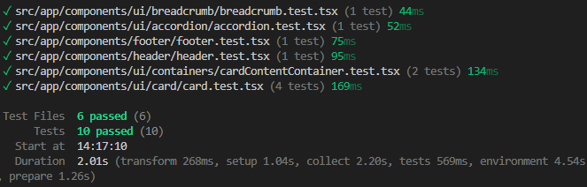
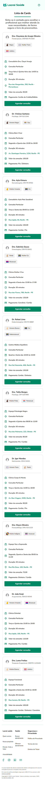
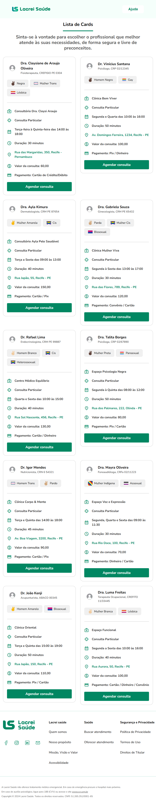
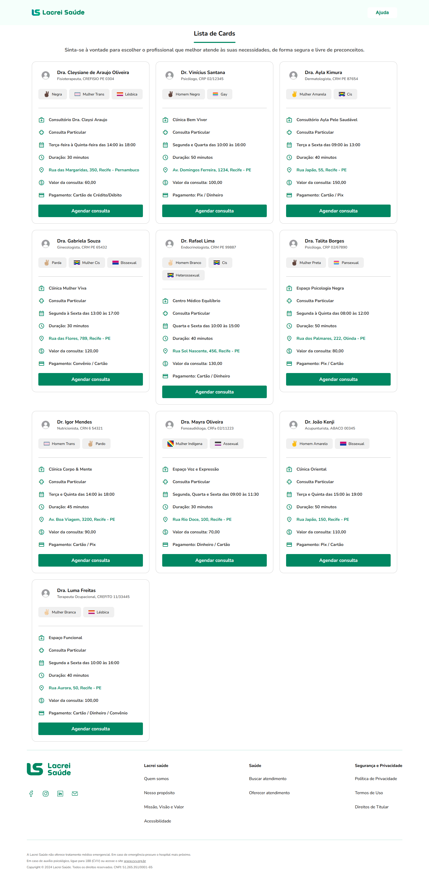
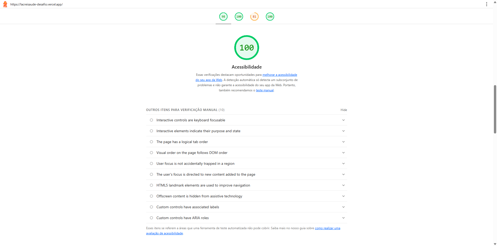

# 💻 Desafio Técnico – Front-end na Lacrei Saúde

​

## ⭐ Objetivo

​
Sua missão será desenvolver duas páginas web interativas, com foco em acessibilidade, responsividade e impacto visual — sempre respeitando a identidade da Lacrei Saúde e nossa missão de garantir que **cada pessoa se sinta segura ao buscar cuidado**.

Este desafio também se conecta com os fluxos de Back-end e DevOps, para garantir que a entrega esteja pronta para ambientes reais de produção, refletindo um trabalho colaborativo e completo.
​

---

​

## ⭐ O que esperamos de você — Os itens abaixo são obrigatórios:

1 - **Header e Footer com essencia acolhedora e inclusiva da Lacrei Saúde**

2 - **Três botões interativos**

3 - **Respeito ao nosso guia de estilo**

4 - **Responsividade impecável**

5 - **Tecnologias obrigatórias**

-   **Next.js** e **TypeScript** para estrutura moderna e escalável.
-   **Styled-Components** para estilização modular, clara e reutilizável.

6 - **Testes unitários**

-   Utilize **Jest** para testar pelo menos dois componentes do seu projeto.
-   Documente a execução dos testes no `README`.

7 - **Deploy da aplicação**

-   Faça o deploy da aplicação (recomendamos Vercel)
-   Inclua o link de produção no `README do GitHub.`
    ​

## 📝 Documentação esperada (README)

-   Instruções para rodar o projeto localmente
-   Instruções para build e deploy
-   Registro dos testes aplicados
-   Proposta de **rollback simples** (ex: como restaurar uma versão anterior na plataforma de deploy)
-   Comentários sobre as escolhas visuais e técnicas realizadas
-   (Opcional) Simulação de integração com a API de Back-end usando mock ou JSON local

# 📝 Documentação

### Rodando o projeto localmente

Antes de tudo, você precisa clonar o repositório

```bash
  git clone https://github.com/henriquegoncalvessilva/desafio-lacrei-saude
```

Após isso, entre no diretório

```bash
  cd minha-pasta/desafio-tech-front-lacreisaude\front>
```

Instale todas as dependências. Esse passo é muito importante para o sucesso das demais etapas.

```bash
  npm install
```

Rode o projeto com o código abaixo

```bash
  npm run dev
```

### Rodar o servidor localmente(Opcional)

**Os dados inicialmente estão mockados. Porém, você pode usar o JSON SERVER para rodar um servidor local. Basta acessar o link: https://www.npmjs.com/package/json-server e seguir os passos. É bem simples.**

Já para acessar os dados no Front, você precisa usar hooks(ex: useEffect) junto com o Axios(biblioteca JavaScript, utilizada para fazer requisições HTTP). Para mais informações sobre, basta acessar a documentação do próprio Next - https://nextjs.org/docs/app/getting-started/fetching-data#with-the-fetch-api

### Deploy

Para o deploy, utilizei o Vercel devido a sua fácilidade de realizar tal ação. Segue abaixo o link do **deploy**

https://lacreisaude-desafio.vercel.app/

## Rollback

Para realizar um **rollback** na VERCEL, basta:

1 - Acessar o painel da Vercel

2 - Ir na aba "Deployments"

3 - Clicar nos três pontinhos do lado direito do deploy

4 - Por fim, clicar em "Redeploy".

Obs: É importante que o projeto do Vercel, esteja conectado a conta do GitHub, caso contrário, não dá para fazer o rollback usando a Vercel.

## Testes unitários

Os componentes que estão sendo testados são:

      - BreadCrumb
        - Testa se existe o botão de navegação para a tela inicial;

      - Footer
        - Testa se as redes sociais e os títulos das informações do footer existem.

      - Header
        - Testa se existe o botão de navegação para a tela de Ajuda;

      - Accordion
        - Testa se o componente Accordion, que é usado na tela de ajuda, está exibindo as informações quando elas são passadas.

      - Card Content Container
        - Testa se o componente exibe a mensagem de erro quando não existem registros na tela de ajuda.

      - Card
        - Testa se as informações dos profissionais são exibidas quando os dados são passados para o componente.

**Para o teste utilizei o Vitest, pois tive algumas dificuldades de instalação/configuração do Jest.**

### Print da execução dos testes listados acima:



Para rodar os testes unitários, basta executar o comando abaixo, e no fim do test é gerado o **vitest-report.json**, onde pode encontrar todos os registros dos testes.

```bash
  npm run test
```

# Screenshots

Estrutura das pastas e arquivos.


Obs: Preferi por dividir uma pasta para componentes e uma pasta para componentes em geral(ui). A estrutura basicamente de cada pasta consistem em:

-   componente
    -   style
    -   arquivoteste(se for o caso)

## Layouts

As telas foram testadas usando o plugin(navegador) Reponsive Viewer e o inspector do navegador.

### Mobile



### Tablet



### Notebook - Desktop



## Status de acessibilidade e desempenho - Lighthouse




